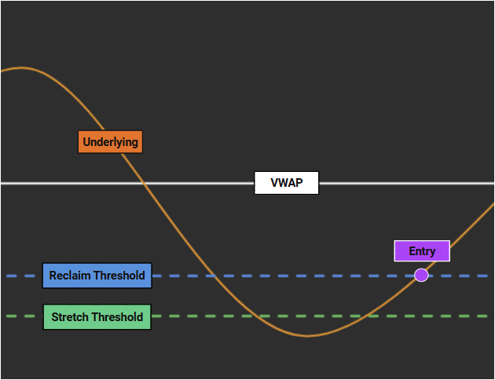

   

# VWAP Reclaim Lab

[Features at a Glance](#features-at-a-glance) | [Folder Guide](#folder-guide) | [Key Tech](#key-tech)

## Introduction

An intraday options backtesting framework - built around VWAP stretch-and-reclaim signals. Built with clean boundaries for data, signals, option selection, exits, and reporting.

Includes simulations for contract scaling and real-world friction (latency, slippage, fees).

Fully cacheable, sweep-ready, and designed for reproducible backtests and optimization.

(With an obnoxious amount of prints for data integrity and auditability.)

## Features at a Glance

**Signals:** Detects a stretch away from VWAP beyond a threshold - and a partial reclaim towards it. The stretch-and-reclaim movement must occur in a specific window.

**Option Selection:** Sweepable parameters for ITM/ATM/OTM and strike depth. Buys calls and puts based on stretch direction. Same-day expiry enforced by default.

**Exits:** Take-profit, stop-loss, max hold duration, end-of-day, and emergency failsafe exits.

**Trading Friction:** Latency, slippage, commissions/fees.

**Bayesian Optimizer:** `optimize/smart.py` utilizes Optuna for parameter sweeps over a discrete search space. Built for concurrency and parallelism.

### Key Parameters (Subset):

| Parameter | Example | Description |
|---|---|---|
| `stretch_threshold` | `0.003` | Min percent move away from VWAP. |
| `reclaim_threshold` | `0.0021` | Percent move back toward VWAP (after initial stretch). |
| `cooldown_period_seconds` | `120` | Throttle multiple signals per stretch event. |
| `option_selection_mode` | `itm` | `itm`/`otm`/`atm` selection. |
| `strikes_depth` | `1` | 1 = closest depth to ATM within the chosen mode. |
| `take_profit_percent` | `80` | Exit on gain. |
| `stop_loss_percent` | `-25` | Exit on loss. |
| `max_trade_duration_seconds` | `600` | Time-based exit. |

Full details in [strategy/README.md](strategy/).

## Folder Guide

| Path | What’s Inside |
|---|---|
| `strategy/` | Core logic: parameters, data loading, signals, option selection, exits, backtest, reporting. See [strategy/README.md](strategy/). |
| `optimize/` | Parameter sweeps with Optuna and Postgres-backed storage. Prunes low-trade trials, deduplicates param combos, and reports best trials. See [optimize/README.md](optimize/). |
| `quickstart/` | One-command run with bundled synthetic data. See [quickstart/README.md](quickstart/). |
| `tests/` | Basic correctness and regression tests against synthetic data. |

**NOTE:** Synthetic data is used in `quickstart/` and `tests/` to adhere to Polygon's terms.

## Key Tech

| Tech | Description/Utilization |
|---|---|
| Python | Install packages via `requirements.txt`. |
| Polygon.io API | Stocks and Options Developer plans (or higher) are required to pull historical data at one second aggregates.  |
| Optuna | Bayesian optimization engine used by `optimize/smart.py` to sweep parameters. |
| PostgreSQL | Persists Optuna studies and deduplicates parameter combos; configure `PG_*` env vars. Useful for parallel and/or multi-run parameter sweeps. |
| Docker | Reproducible environment and fast builds for virtual/ephemeral compute. |
