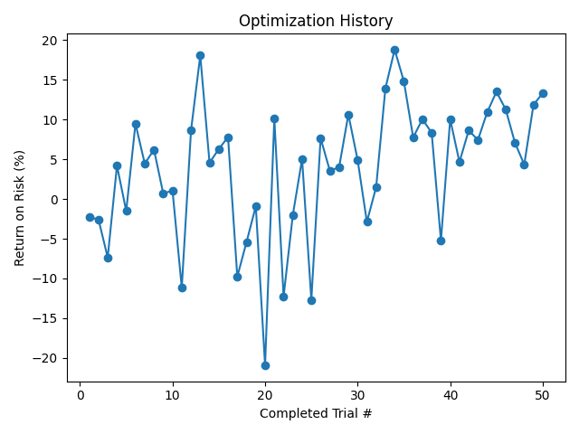

# Strategy Optimization

Parameter sweeps, powered by Optuna, with Postgres-backed persistence.


## File Breakdown

| File | Purpose |
|---|---|
| `smart.py` | Core optimizer. Runs Optuna's TPE Sampler against `strategy/`. Includes Postgres persistence and duplicate checks/pruning. |
| `launch.py` | Runs N optimizer workers in parallel (each runs `smart.py`). Running `python -m optimize.launch 5` starts 5 workers and waits for all to finish. |
| `check_study.py` | Study inspector. Loads the Postgres-backed study, reports trial counts and duplicates, and saves `db_opt_history.png` showing objective over completed trials. |
| `export_top_trials.py` | CSV exporter. Dumps the top-N completed trials (objective, parameters, and user attributes) to `top_trials.csv`. |


## Objective and Dimensions

**Objective:** Maximize average return on risk (`return_on_risk_percent`).

### Dimensions:

| Name | Values |
|---|---|
| `entry_window` | 0: 9:30–10:30, 1: 9:30–12:00, 2: 12:00–15:00, 3: 15:00–15:45, 4: 9:30–15:45 |
| `stretch_threshold` | 0.001–0.02 (discrete set) |
| `reclaim_percentage` | 0.4–0.8 (percentage of stretch) |
| `cooldown_period_seconds` | 60, 90, 120, 180, 300, 600 |
| `take_profit_percent` | 25, 35, 50, 60, 70, 80, 90, 100 |
| `stop_loss_percent` | -25, -35, -50, -60, -70, -80, -90, -100 |
| `max_trade_duration_seconds` | 60, 120, 180, 240, 300, 600 |
| `strikes_depth` | 1 |
| `option_selection_mode` | `itm`, `otm` |


## Run It

```bash
python -m optimize.smart
```

### Useful Settings Inside `smart.py`:

| Setting | Purpose |
|---|---|
| `STUDY_NAME` | Name of the Optuna study. Use different names to test different strategy variants. |
| `N_TRIALS` | Target number of completed trials. Does not include pruned trials (e.g. failures, not enough trades, duplicates). |
| `ENABLE_PERSISTENCE` | If true, continues adding more trials to existing study. If false, deletes the existing study and starts fresh. |
| `N_STARTUP_TRIALS` | N randomized trials before TPE Sampler kicks in. |
| `N_EI_CANDIDATES` | Candidates per TPE trial. |
| `MIN_TRADE_THRESHOLD` | Minimum trades required to count as a completed trial. Trials are pruned if they don't meet this threshold. |
| `MAX_ATTEMPT_LIMIT` | Cap on total attempts (completed + pruned). Prevents `smart.py` from running indefinitely. |


## Artifacts (Examples)

### Optimization History

Maps objective (return on risk) over completed trials:



### Top Trials 

Top completed trials with parameters and stored metrics (as user attributes).

Sorted from best to worst objective result.

|   rank |   trial_number |   objective_value |   param_entry_window |   param_reclaim_percentage |   param_stretch_threshold |   param_stop_loss_percent |   param_strikes_depth | param_option_selection_mode   |   param_take_profit_percent |   param_cooldown_period_seconds |   param_max_trade_duration_seconds |   attr_avg_risk_per_trade |   attr_expectancy |   attr_win_rate |   attr_sharpe_ratio |   attr_return_on_risk_percent |   attr_total_trades |
|-------:|---------------:|------------------:|---------------------:|---------------------------:|--------------------------:|--------------------------:|----------------------:|:------------------------------|----------------------------:|--------------------------------:|-----------------------------------:|--------------------------:|------------------:|----------------:|--------------------:|------------------------------:|--------------------:|
|      1 |            108 |          18.7957  |                    4 |                        0.4 |                     0.003 |                       -50 |                     1 | itm                           |                          90 |                             120 |                                120 |                   83.4076 |          15.6771  |         58.8235 |            0.466648 |                      18.7957  |                  17 |
|      2 |             33 |          18.0533  |                    4 |                        0.6 |                     0.003 |                       -70 |                     1 | otm                           |                          50 |                              90 |                                180 |                   72.0318 |          13.0041  |         55.1724 |            0.411843 |                      18.0533  |                  29 |
|      3 |            114 |          14.776   |                    4 |                        0.4 |                     0.003 |                       -60 |                     1 | itm                           |                          90 |                             120 |                                120 |                   99.5692 |          14.7124  |         58.8235 |            0.470332 |                      14.776   |                  17 |
|      4 |            106 |          13.912   |                    4 |                        0.4 |                     0.003 |                       -90 |                     1 | otm                           |                          90 |                             120 |                                120 |                  103.736  |          14.4318  |         52.9412 |            0.465479 |                      13.912   |                  17 |
|      5 |             99 |          10.6277  |                    4 |                        0.6 |                     0.003 |                       -70 |                     1 | otm                           |                          90 |                             120 |                                120 |                   75.3618 |           8.00923 |         43.5897 |            0.415214 |                      10.6277  |                  39 |
|      6 |             61 |          10.1192  |                    4 |                        0.4 |                     0.003 |                       -60 |                     1 | otm                           |                          60 |                             180 |                                180 |                   71.1989 |           7.20474 |         42.1053 |            0.339015 |                      10.1192  |                  19 |
|      7 |            124 |          10.0327  |                    0 |                        0.4 |                     0.003 |                       -50 |                     1 | otm                           |                          50 |                             600 |                                180 |                   64.9972 |           6.521   |         45      |            0.237748 |                      10.0327  |                  20 |
|      8 |            128 |          10.0207  |                    0 |                        0.4 |                     0.003 |                       -60 |                     1 | itm                           |                          60 |                             600 |                                180 |                  106.67   |          10.689   |         45      |            0.292536 |                      10.0207  |                  20 |
|      9 |             19 |           9.47377 |                    2 |                        0.6 |                     0.003 |                       -25 |                     1 | itm                           |                          25 |                             120 |                                120 |                   33.2209 |           3.14727 |         36.3636 |            0.144901 |                       9.47377 |                  11 |
|     10 |             32 |           8.62484 |                    2 |                        0.6 |                     0.003 |                       -70 |                     1 | otm                           |                          50 |                             120 |                                180 |                   52.4489 |           4.52364 |         36.3636 |            0.17267  |                       8.62484 |                  11 |

Preview (first rows):

```csv
rank,trial_number,objective_value,param_entry_window,param_stretch_threshold,param_reclaim_percentage,param_cooldown_period_seconds,param_take_profit_percent,param_stop_loss_percent,param_max_trade_duration_seconds,param_strikes_depth,param_option_selection_mode,attr_total_trades,attr_return_on_risk_percent
1,12,84.5,4,0.006,0.6,120,50,-50,180,1,otm,24,84.5
2,37,79.2,1,0.004,0.7,180,60,-60,300,1,itm,18,79.2
```
